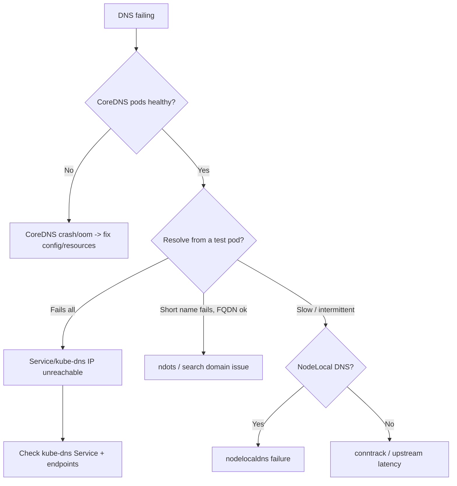

# Playbook: DNS Failures

## When to use this playbook

Use this when in-cluster name resolution breaks: services can't resolve other
services by name, lookups are slow or intermittent, or `nslookup`/`getaddrinfo`
fails inside pods. DNS sits under almost every other failure (image pulls, app
connectivity, webhooks), so confirming or ruling it out fast is high-leverage.
Covers CoreDNS health, NodeLocal DNS, `ndots` blow-ups, and headless/Service
record issues. Triage is read-only.

## Symptoms

- App logs: `no such host`, `Temporary failure in name resolution`, `getaddrinfo ENOTFOUND`.
- Lookups intermittently time out (~5s stalls) or are slow under load.
- Only short names fail while FQDNs work (search/`ndots` issue).
- CoreDNS pods `CrashLoopBackOff` or restarting; cluster-wide impact.

## Triage flow



## Step-by-step

1. **Check CoreDNS health first — it's cluster-wide.**

   ```bash
   kubectl get pods -n kube-system -l k8s-app=kube-dns -o wide
   kubectl logs -n kube-system -l k8s-app=kube-dns --tail=50
   ```

   Restarts/CrashLoop or `plugin/errors` in logs explain a total outage.

2. **Confirm the DNS Service and its endpoints exist.**

   ```bash
   kubectl get svc -n kube-system kube-dns
   kubectl get endpoints -n kube-system kube-dns
   ```

   Empty endpoints = CoreDNS not Ready; the ClusterIP must match pods' `/etc/resolv.conf`.

3. **Resolve from inside a pod (read-only diagnostic).**

   ```bash
   kubectl run dnstest --image=busybox:1.36 --restart=Never --rm -it -- \
     nslookup kubernetes.default.svc.cluster.local
   ```

   Compare short name vs. FQDN to spot `ndots`/search-domain problems.

4. **Inspect a workload pod's resolver config.**

   ```bash
   kubectl exec <pod> -n <namespace> -- cat /etc/resolv.conf
   ```

   Check `nameserver` (kube-dns IP), `search`, and `options ndots:5`.

5. **If NodeLocal DNSCache is deployed, check it:**

   ```bash
   kubectl get pods -n kube-system -l k8s-app=node-local-dns -o wide
   ```

## Common root causes & fixes

| Root cause | Fix | Error page |
| --- | --- | --- |
| General resolution failure | Diagnose CoreDNS + Service path | [dns-resolution-failure](../errors/networking/dns-resolution-failure.md) |
| CoreDNS crashing | Fix Corefile/loop/resources | [coredns-crashloopbackoff](../errors/networking/coredns-crashloopbackoff.md) |
| Slow lookups | Cache/autopath/upstream | [coredns-slow-lookups](../errors/networking/coredns-slow-lookups.md) |
| Excess lookups / 5s stalls | Tune `ndots`/use FQDN | [ndots-extra-dns-lookups](../errors/networking/ndots-extra-dns-lookups.md) |
| NodeLocal cache broken | Repair node-local-dns | [nodelocaldns-failure](../errors/networking/nodelocaldns-failure.md) |
| Service name won't resolve | Check Service/namespace/FQDN | [service-name-not-resolving](../errors/networking/service-name-not-resolving.md) |
| Headless SRV records missing | Fix headless Service / ports | [service-srv-records-missing](../errors/services/service-srv-records-missing.md) |
| StatefulSet pod DNS missing | Fix headless governing Service | [statefulset-dns-not-resolving](../errors/statefulsets/statefulset-dns-not-resolving.md) |

## Recovery

1. **If CoreDNS config is the cause**, fix the `coredns` ConfigMap (e.g. a loop
   or bad forward) and let the rollout apply. **Blast radius: a CoreDNS config
   change is cluster-wide DNS** — validate the Corefile and watch one replica.
2. **Restarting CoreDNS** (`kubectl rollout restart deploy/coredns -n kube-system`)
   clears a wedged cache/state. **Blast radius: brief DNS blip during rollout**;
   replicas restart gradually, so resolution stays available — safer than
   deleting all CoreDNS pods at once.
3. **Scale CoreDNS up** if it's overloaded (more replicas / HPA), rather than
   tightening timeouts. Non-disruptive.
4. **For `ndots` stalls**, set `dnsConfig` / use FQDNs in the affected workload;
   a per-pod spec change is non-disruptive (rolling update).
5. Avoid editing `/etc/resolv.conf` on nodes by hand — kubelet manages pod DNS;
   manual node edits are **disruptive and drift-prone**.

## Validation

- A test pod resolves both `kubernetes.default` and an app Service FQDN.
- CoreDNS pods `Running`/`Ready` with stable restart counts and `kube-dns` endpoints populated.
- App `no such host` errors stop; latency to dependencies returns to baseline.

## Prevention

- Run CoreDNS with adequate replicas/resources and a PDB; consider NodeLocal DNSCache.
- Reduce `ndots` or use FQDNs for hot external lookups to cut query amplification.
- Monitor CoreDNS error/latency metrics and pod restarts.
- Avoid DNS loops (don't forward to the cluster's own resolver).
- Keep conntrack table sized for DNS-heavy workloads (see node conntrack limits).

## Related playbooks & errors

- [Playbook: Networking Failures](./networking-failures.md)
- [Playbook: Image Pull Failures](./image-pull-failures.md)
- [Playbook: Pods Won't Start](./pods-wont-start.md)
- [service-headless-no-records](../errors/services/service-headless-no-records.md), [node-conntrack-table-full](../errors/nodes/node-conntrack-table-full.md)

## Further Reading

- [DevOps AI ToolKit — Kubernetes guides](https://devopsaitoolkit.com/blog/)
