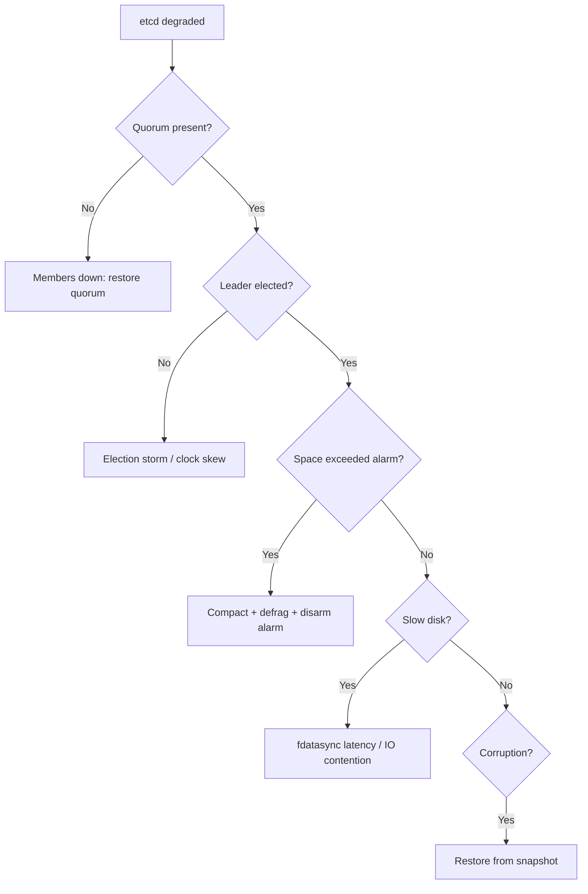

# Playbook: etcd Unavailable

## When to use this playbook

Use this playbook when etcd — the cluster's source of truth — is unhealthy: lost
quorum, no leader, members down, database space exceeded, corruption, or slow
disk causing API timeouts. etcd problems are Critical because the API server
becomes read-only or unavailable and no state changes can be persisted. This
playbook is backup-first: every disruptive etcd action risks permanent data loss,
so confirm a recent snapshot before acting.

## Symptoms

- API server logs `etcdserver: request timed out` or `context deadline exceeded`
- `etcdctl endpoint health` reports members unhealthy / no leader
- `mvcc: database space exceeded` and the cluster goes read-only
- `etcd-data-corruption` / mismatched revisions across members
- High `wal_fsync` latency; API requests intermittently slow

## Triage flow



## Step-by-step

All commands are read-only. Set these once on a control-plane node:

```bash
export ETCDCTL_API=3
export EP=https://127.0.0.1:2379
export TLS="--cacert=/etc/kubernetes/pki/etcd/ca.crt --cert=/etc/kubernetes/pki/etcd/server.crt --key=/etc/kubernetes/pki/etcd/server.key"
```

1. Check member and endpoint health:

   ```bash
   etcdctl --endpoints=$EP $TLS member list -w table
   etcdctl --endpoints=$EP $TLS endpoint health --cluster -w table
   ```

   Reveals which members are down and whether quorum exists.

2. Check leader, DB size, and revisions per endpoint:

   ```bash
   etcdctl --endpoints=$EP $TLS endpoint status --cluster -w table
   ```

   Reveals the leader, `DB SIZE`, and any revision mismatch (corruption signal).

3. Look for active alarms (space exceeded / corrupt):

   ```bash
   etcdctl --endpoints=$EP $TLS alarm list
   ```

   A `NOSPACE` alarm explains a read-only cluster.

4. Inspect etcd pod logs for fsync latency and apply delays:

   ```bash
   crictl ps -a | grep etcd
   crictl logs <etcd-container-id> 2>&1 | grep -Ei 'slow|fsync|took too long|leader' | tail -40
   ```

   Reveals slow-disk and leader-change patterns.

5. Confirm clock sync (skew breaks raft):

   ```bash
   timedatectl status
   ```

   Large skew across members causes election churn.

6. **Verify a recent snapshot exists before any change:**

   ```bash
   ls -lh /var/lib/etcd-backups/ 2>/dev/null
   etcdctl --endpoints=$EP $TLS snapshot save /tmp/etcd-pre-incident.db
   ```

   The save is read-only against the keyspace and gives you a fallback.

## Common root causes & fixes

| Root cause | Fix | Reference |
|---|---|---|
| Quorum lost / members down | Restore members/quorum | [etcd-cluster-unavailable.md](../errors/etcd/etcd-cluster-unavailable.md) |
| No leader / elections | Fix network/clock | [etcd-no-leader.md](../errors/etcd/etcd-no-leader.md) |
| DB space exceeded | Compact + defrag + disarm | [etcd-mvcc-database-space-exceeded.md](../errors/etcd/etcd-mvcc-database-space-exceeded.md) |
| Fragmentation | Defragment members | [etcd-needs-defragmentation.md](../errors/etcd/etcd-needs-defragmentation.md) |
| Slow fdatasync | Faster disk / isolate IO | [etcd-slow-fdatasync.md](../errors/etcd/etcd-slow-fdatasync.md) |
| Member unhealthy | Replace member | [etcd-member-unhealthy.md](../errors/etcd/etcd-member-unhealthy.md) |
| Data corruption | Restore from snapshot | [etcd-data-corruption.md](../errors/etcd/etcd-data-corruption.md) |
| Request timeouts | Reduce load / defrag | [etcd-request-timed-out.md](../errors/etcd/etcd-request-timed-out.md) |
| Clock skew | Fix NTP | [etcd-clock-difference-too-high.md](../errors/etcd/etcd-clock-difference-too-high.md) |

## Recovery

1. **Always snapshot first** (step 6 above). Treat etcd as irreplaceable.
2. For a `NOSPACE` alarm: compact to a recent revision, defragment, then disarm.
   **Blast radius: defragmentation blocks the member it runs on for seconds to
   minutes — run one member at a time, never the leader first. Safer alternative:
   defrag followers during low traffic, then the leader last.**
3. To replace a failed member: remove it from the member list, wipe its data dir,
   and re-add it. **Blast radius: removing a member from a 3-node cluster leaves
   no fault tolerance until the new member syncs — never remove two at once or
   you lose quorum permanently.**
4. For corruption or total quorum loss, restore from the latest snapshot.
   **Blast radius: snapshot restore reverts the entire cluster state to the
   snapshot time — changes since then are lost. Stop the API server, restore on
   all members to a consistent data dir, then restart. Safer alternative: restore
   onto a single member and rebuild a fresh cluster from it.**

## Validation

- `endpoint health --cluster` reports all members healthy with a leader.
- `alarm list` is empty; DB size dropped after defrag.
- API server `/readyz` returns `ok`; writes succeed again.
- No recurring `took too long` / leader-change log lines.

## Prevention

- Run etcd on dedicated low-latency SSDs, isolated from other IO.
- Automate frequent `snapshot save` with offsite retention and restore drills.
- Set `--auto-compaction-retention` and alert on DB size approaching the quota.
- Keep tight NTP sync and a 3- or 5-member topology for quorum.

## Related playbooks & errors

- [Playbook: API Server Unavailable](./api-server-unavailable.md)
- [Playbook: Cluster Upgrade Failures](./cluster-upgrade-failures.md)
- [etcd-leader-changed.md](../errors/etcd/etcd-leader-changed.md)
- [etcd-apply-took-too-long.md](../errors/etcd/etcd-apply-took-too-long.md)

## Further Reading

- [DevOps AI ToolKit — Kubernetes guides](https://devopsaitoolkit.com/blog/)
