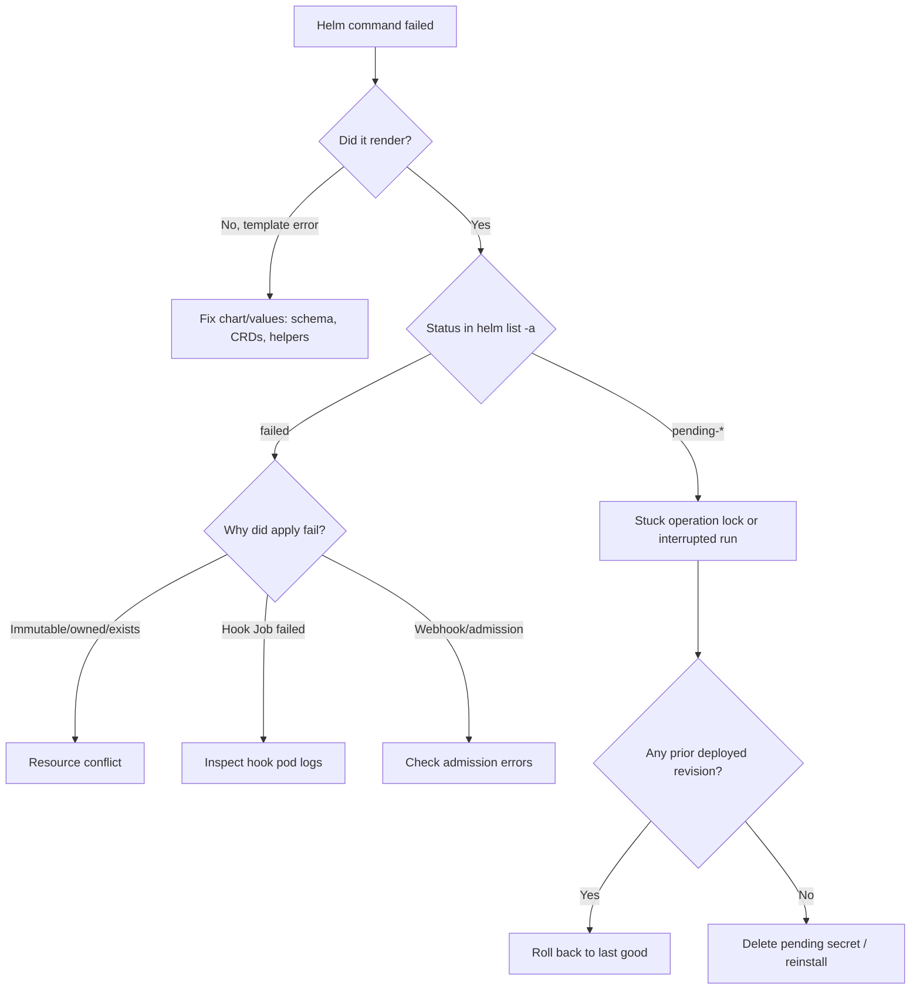

# Playbook: Helm Release Failures

## When to use this playbook

Use this playbook when a `helm install`, `helm upgrade`, or `helm rollback`
returns a non-zero exit, hangs, or leaves a release in a `pending-*` or `failed`
state. It applies whether the failure is a rendering/templating problem, a
Kubernetes apply rejection, a stuck operation lock, or post-deploy hooks that
never complete. The goal is to identify which phase of the release lifecycle
broke and restore the release to a healthy `deployed` revision without
corrupting Helm's stored history.

## Symptoms

- `helm upgrade` exits with `UPGRADE FAILED` or `another operation ... is in progress`
- `helm list -a` shows status `failed`, `pending-install`, `pending-upgrade`, or `pending-rollback`
- Rendered objects never appear, or appear then get rejected by admission/validation
- Post-install/post-upgrade hook Jobs stay `Running` or `Failed`
- `helm rollback` itself fails, or there are "no deployed releases" to roll back to

## Triage flow



## Step-by-step

All commands below are read-only diagnostics.

1. List every release including failed/pending ones to see true state:

   ```bash
   helm list -A -a
   ```

   Reveals the release `STATUS`, current `REVISION`, and chart version.

2. Inspect the release history to find the last `deployed` revision:

   ```bash
   helm history <release> -n <namespace> --max 20
   ```

   The most recent row with status `deployed` is your safe rollback target.

3. Read the failure detail Helm recorded:

   ```bash
   helm status <release> -n <namespace>
   ```

   Shows the last error string (apply rejection, hook failure, timeout).

4. Render locally to isolate templating from apply problems:

   ```bash
   helm get manifest <release> -n <namespace>
   helm template <release> <chart> -f values.yaml --debug
   ```

   If `template` fails, the problem is the chart/values, not the cluster.

5. Inspect the resources Helm tried to manage and recent events:

   ```bash
   kubectl get all,secret,configmap -n <namespace> -l app.kubernetes.io/instance=<release>
   kubectl get events -n <namespace> --sort-by=.lastTimestamp | tail -30
   ```

   Reveals immutable-field, already-exists, or ownership-metadata conflicts.

6. If hooks are involved, inspect the hook Job and its pod logs:

   ```bash
   kubectl get jobs -n <namespace>
   kubectl logs job/<hook-job> -n <namespace>
   ```

   Reveals why a `post-install`/`pre-upgrade` hook failed or hung.

7. Inspect the Helm release storage object (Secret/ConfigMap) to confirm the lock:

   ```bash
   kubectl get secret -n <namespace> -l owner=helm,name=<release>
   ```

   A `pending-*` labeled secret with no newer `deployed` one is the stuck lock.

## Common root causes & fixes

| Root cause | Fix | Reference |
|---|---|---|
| Apply rejected on upgrade | Reconcile diff, fix values, re-run | [helm-upgrade-failed.md](../errors/helm/helm-upgrade-failed.md) |
| Operation lock held | Wait or clear stale pending secret | [helm-another-operation-in-progress.md](../errors/helm/helm-another-operation-in-progress.md) |
| Stuck in pending-install/upgrade | Roll back / delete pending revision | [helm-release-stuck-pending.md](../errors/helm/helm-release-stuck-pending.md) |
| No deployed release to roll back | Reinstall or uninstall+install | [helm-no-deployed-releases.md](../errors/helm/helm-no-deployed-releases.md) |
| Immutable field patch | Recreate resource out-of-band | [helm-cannot-patch-immutable.md](../errors/helm/helm-cannot-patch-immutable.md) |
| Resource already exists | Adopt with ownership metadata | [helm-resource-already-exists.md](../errors/helm/helm-resource-already-exists.md) |
| Hook Job failed | Fix hook image/command | [helm-hook-failed.md](../errors/helm/helm-hook-failed.md) |
| Rollback failed | Manual reconcile of revision | [helm-rollback-failed.md](../errors/helm/helm-rollback-failed.md) |

## Recovery

1. Identify the last `deployed` revision from `helm history`. This is your target.
2. Roll back to it: `helm rollback <release> <rev> -n <namespace>`. **Blast radius:
   recreates/patches the release's workloads; for multi-replica Deployments this
   is a rolling, near-zero-downtime change. Safer alternative: `--dry-run` first,
   then roll back during a maintenance window.**
3. If a `pending-*` lock blocks all operations and no run is actually executing,
   removing the stale pending release secret unblocks Helm. **Blast radius:
   editing Helm's storage can lose release history if you delete the wrong secret
   — back it up first with `kubectl get secret ... -o yaml`. Safer alternative:
   roll back to the prior revision, which supersedes the pending one cleanly.**
4. If there is no deployed revision at all, prefer `helm uninstall --keep-history`
   review, then a clean `helm install`, rather than hand-deleting live objects.

## Validation

- `helm list -A -a` shows the release `deployed` at the expected revision.
- `helm status <release>` reports no errors and lists the expected resources.
- `kubectl rollout status deploy/<name> -n <namespace>` completes.
- Hook Jobs are `Complete`; application healthchecks pass.

## Prevention

- Keep `values.schema.json` strict and validate in CI with `helm lint`/`template`.
- Use `--atomic --timeout` so failed upgrades auto-roll-back instead of sticking.
- Separate CRD installation from chart upgrades to avoid `no matches for kind`.
- Make hooks idempotent and add `helm.sh/hook-delete-policy`.
- Avoid concurrent CD pipelines targeting the same release (the lock cause).

## Related playbooks & errors

- [Playbook: Cluster Upgrade Failures](./cluster-upgrade-failures.md)
- [helm-values-schema-validation.md](../errors/helm/helm-values-schema-validation.md)
- [helm-crd-no-matches-for-kind.md](../errors/helm/helm-crd-no-matches-for-kind.md)
- [helm-rendered-manifest-invalid.md](../errors/helm/helm-rendered-manifest-invalid.md)

## Further Reading

- [DevOps AI ToolKit — Kubernetes guides](https://devopsaitoolkit.com/blog/)
