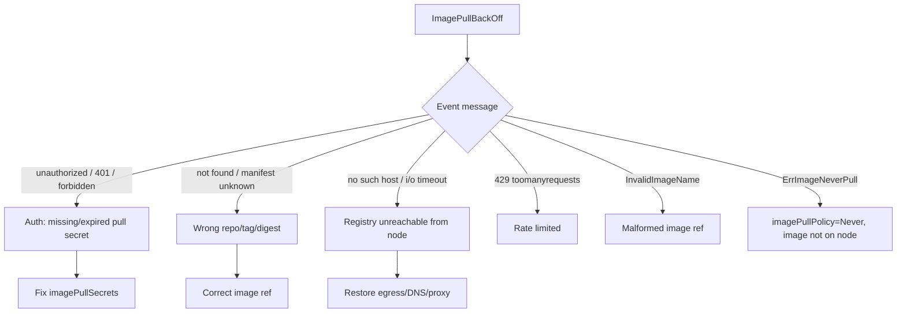

# Playbook: Image Pull Failures

## When to use this playbook

Use this when pods can't fetch their container image — `ErrImagePull`,
`ImagePullBackOff`, `ErrImageNeverPull`, `InvalidImageName`, or registry rate
limiting — and the workload is stuck before the container ever runs. This is
common right after a deploy with a new tag, after a registry credential
rotation, or when a node loses egress to the registry. Triage is read-only.

## Symptoms

- `kubectl get pods` shows `ErrImagePull` then `ImagePullBackOff` (with back-off).
- Events: `Failed to pull image ...: unauthorized`, `not found`, `no such host`, or `429 Too Many Requests`.
- Only pods scheduled to certain nodes fail (node-local egress/credential issue).
- A brand-new ReplicaSet is stuck while the old one still serves traffic.

## Triage flow



## Step-by-step

1. **Confirm the state and the exact image being pulled.**

   ```bash
   kubectl get pods -n <namespace> -o wide
   kubectl get pod <pod> -n <namespace> -o jsonpath='{range .spec.containers[*]}{.image}{"\n"}{end}'
   ```

   Verify the registry host, repository, and tag are what you expect — a typo'd
   tag is the most common cause.

2. **Read the precise failure reason.**

   ```bash
   kubectl describe pod <pod> -n <namespace> | grep -A5 -i "Failed\|pull"
   ```

   The substring after `Failed to pull image` tells you auth vs. not-found vs.
   network vs. rate-limit.

3. **Check the pull secret is referenced and valid.**

   ```bash
   kubectl get pod <pod> -n <namespace> -o jsonpath='{.spec.imagePullSecrets}'
   kubectl get secret <pull-secret> -n <namespace> -o jsonpath='{.type}'
   ```

   The type should be `kubernetes.io/dockerconfigjson`. A missing reference or
   wrong namespace is a frequent miss.

4. **Determine if it is node-scoped** — list which nodes the failing pods are on;
   if all failures share one node, suspect node egress/credentials:

   ```bash
   kubectl get pods -n <namespace> -o wide | grep -i "ImagePull\|ErrImage"
   ```

5. **Look for rate limiting** (Docker Hub anonymous pulls):

   ```bash
   kubectl get events -n <namespace> --sort-by=.lastTimestamp | grep -i "429\|toomanyrequests"
   ```

## Common root causes & fixes

| Root cause | Fix | Error page |
| --- | --- | --- |
| Missing/expired `imagePullSecrets` | Recreate `dockerconfigjson` secret, reference it | [imagepullbackoff](../errors/pods/imagepullbackoff.md) |
| Wrong repo/tag/digest | Correct the image reference | [errimagepull](../errors/pods/errimagepull.md) |
| Malformed image string | Fix syntax (no spaces, valid tag) | [invalidimagename](../errors/pods/invalidimagename.md) |
| `imagePullPolicy: Never`, image absent on node | Pre-load image or change policy | [errimageneverpull](../errors/pods/errimageneverpull.md) |
| Docker Hub rate limit | Authenticate / mirror / cache | [image-pull-toomanyrequests](../errors/pods/image-pull-toomanyrequests.md) |
| Registry unreachable from node | Fix DNS/egress/proxy | [dns-resolution-failure](../errors/networking/dns-resolution-failure.md) |
| Bad/corrupt layer at runtime | Re-push image, clear cache | [failed-to-pull-and-unpack-image](../errors/container-runtime/failed-to-pull-and-unpack-image.md) |
| New ReplicaSet only failing | Fix image before old RS scales down | [deployment-new-replicaset-imagepull](../errors/deployments/deployment-new-replicaset-imagepull.md) |

## Recovery

1. **Fix the root cause first** (secret, tag, or egress). For credential issues,
   recreate the secret and ensure each affected namespace and ServiceAccount
   references it.
2. **Trigger a fresh pull** by `kubectl rollout restart deploy/<name>`.
   **Blast radius: recreates the workload's pods**, but respects surge so the
   healthy old ReplicaSet keeps serving — safer than deleting pods manually.
3. **If a bad new tag broke the rollout**, `kubectl rollout undo deploy/<name>`
   to revert to the last good image. **Blast radius: all replicas revert** and
   it is reversible.
4. **For rate limiting**, switch to an authenticated pull or a pull-through
   cache before retrying; do not loop manual deletes, which only burns quota.

## Validation

- `kubectl get pods -n <namespace>` reaches `Running`/`Ready`.
- `kubectl describe pod <pod>` shows a `Pulled` / `Successfully pulled image` event.
- `kubectl rollout status deploy/<name> -n <namespace>` completes.

## Prevention

- Store images in a registry with HA and authenticated pulls; avoid anonymous Docker Hub.
- Reference images by **digest** for immutability.
- Provision pull secrets via the ServiceAccount or a controller (e.g. external-secrets).
- Run a pull-through mirror inside the cluster/VPC to survive upstream outages.
- Alert on `ImagePullBackOff` so a bad tag is caught before it spreads.

## Related playbooks & errors

- [Playbook: Pods Won't Start](./pods-wont-start.md)
- [Playbook: DNS Failures](./dns-failures.md)
- [errimagepull](../errors/pods/errimagepull.md), [image-filesystem-no-space](../errors/container-runtime/image-filesystem-no-space.md)

## Further Reading

- [DevOps AI ToolKit — Kubernetes guides](https://devopsaitoolkit.com/blog/)
