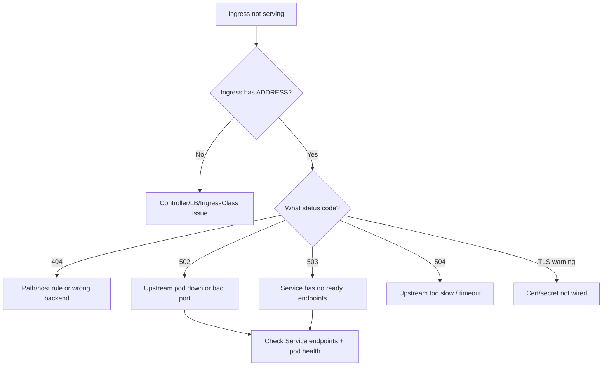

# Playbook: Ingress Failures

## When to use this playbook

Use this playbook when external traffic to a service routed through an Ingress is
failing — 4xx/5xx errors at the edge, a blank Ingress address, TLS warnings, or
requests reaching the wrong backend. It covers the full path from the cloud load
balancer to the Ingress controller to the Service endpoints. The goal is to
localize the break (DNS/LB, controller, Ingress object, Service, or pods) using
read-only checks before changing anything.

## Symptoms

- `502 Bad Gateway`, `503 Service Unavailable`, or `504 Gateway Timeout` from the edge
- `404` default-backend response for a path that should match a rule
- `kubectl get ingress` shows an empty `ADDRESS` column
- Browser shows a fake/self-signed Kubernetes Ingress Controller certificate
- Annotations appear to be ignored, or two controllers fight over the same Ingress

## Triage flow



## Step-by-step

All commands are read-only.

1. Inspect the Ingress object, its class, rules, and address:

   ```bash
   kubectl get ingress -A
   kubectl describe ingress <name> -n <namespace>
   ```

   Reveals the resolved backend Service/port, host/path rules, and whether an
   `ADDRESS` was assigned by the controller.

2. Confirm an IngressClass exists and matches:

   ```bash
   kubectl get ingressclass
   ```

   A missing/mismatched class means no controller claims the Ingress.

3. Check the Ingress controller is healthy:

   ```bash
   kubectl get pods -n ingress-nginx -o wide
   kubectl logs -n ingress-nginx <controller-pod> --tail=100
   ```

   Reveals upstream connect errors, config reload failures, or crashes.

4. Verify the target Service actually has ready endpoints:

   ```bash
   kubectl get svc <svc> -n <namespace>
   kubectl get endpointslices -n <namespace> -l kubernetes.io/service-name=<svc>
   ```

   Empty endpoints is the classic 503/502 cause.

5. Confirm Service selector and ports line up with the pods:

   ```bash
   kubectl describe svc <svc> -n <namespace>
   kubectl get pods -n <namespace> -l <selector> -o wide
   ```

   Reveals selector or `targetPort` mismatches.

6. For TLS issues, inspect the referenced secret:

   ```bash
   kubectl get secret <tls-secret> -n <namespace> -o jsonpath='{.type}'
   kubectl describe ingress <name> -n <namespace> | grep -i tls
   ```

   Reveals whether the secret exists and is `kubernetes.io/tls`.

7. Confirm the edge LB and DNS resolve to the controller:

   ```bash
   kubectl get svc -n ingress-nginx
   ```

   A `Pending` EXTERNAL-IP explains an empty Ingress address.

## Common root causes & fixes

| Root cause | Fix | Reference |
|---|---|---|
| Upstream pod down / bad port | Fix pod health or targetPort | [ingress-502-bad-gateway.md](../errors/ingress/ingress-502-bad-gateway.md) |
| No ready endpoints | Fix Service selector / readiness | [ingress-503-service-unavailable.md](../errors/ingress/ingress-503-service-unavailable.md) |
| Slow upstream | Tune timeouts / scale backend | [ingress-504-gateway-timeout.md](../errors/ingress/ingress-504-gateway-timeout.md) |
| Path doesn't match | Fix path/pathType rule | [ingress-path-not-matching.md](../errors/ingress/ingress-path-not-matching.md) |
| Hits default backend | Correct host/path rules | [ingress-404-default-backend.md](../errors/ingress/ingress-404-default-backend.md) |
| Empty ADDRESS | Fix controller/IngressClass/LB | [ingress-address-empty.md](../errors/ingress/ingress-address-empty.md) |
| No IngressClass | Create/assign IngressClass | [ingress-no-ingressclass.md](../errors/ingress/ingress-no-ingressclass.md) |
| Fake TLS cert | Wire correct TLS secret | [ingress-tls-fake-certificate.md](../errors/ingress/ingress-tls-fake-certificate.md) |
| Annotation ignored | Use controller's prefix/class | [ingress-annotation-ignored.md](../errors/ingress/ingress-annotation-ignored.md) |

## Recovery

1. Restore the backend first: ensure the target pods are `Ready` and the Service
   shows endpoints. Most 502/503s clear once endpoints return.
2. If the controller is wedged, a rolling restart of the controller Deployment
   reloads config. **Blast radius: briefly disrupts ALL Ingress traffic on that
   controller, not just the broken route. Safer alternative: fix the offending
   Ingress/Service and let the controller hot-reload, restarting only as a last
   resort during low traffic.**
3. For TLS, point the Ingress at a valid `kubernetes.io/tls` secret (often
   issued by cert-manager) rather than editing the controller default cert.
4. If two controllers conflict, assign an explicit `ingressClassName` so exactly
   one controller owns the resource. **Blast radius: changing class can move
   traffic between LBs — confirm DNS targets first.**

## Validation

- `kubectl get ingress` shows a stable `ADDRESS`.
- `curl -kSv https://<host>/<path>` returns the expected backend response/code.
- Controller logs show successful upstream connects, no reload errors.
- TLS presents the real certificate chain (no fake-certificate warning).

## Prevention

- Add readiness probes so unhealthy pods leave endpoints automatically.
- Pin `ingressClassName` on every Ingress to avoid multi-controller conflicts.
- Automate certificates with cert-manager and monitor expiry.
- Alert on controller 5xx rate and on Ingresses with empty addresses.

## Related playbooks & errors

- [Playbook: Certificate Expiration](./certificate-expiration.md)
- [ingress-controller-crashloopbackoff.md](../errors/ingress/ingress-controller-crashloopbackoff.md)
- [ingress-upstream-connect-error.md](../errors/ingress/ingress-upstream-connect-error.md)
- [service-no-endpoints.md](../errors/services/service-no-endpoints.md)

## Further Reading

- [DevOps AI ToolKit — Kubernetes guides](https://devopsaitoolkit.com/blog/)
