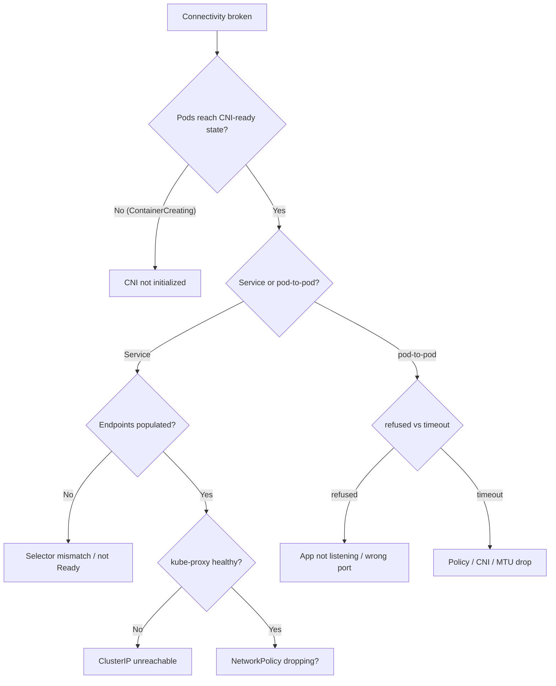

# Playbook: Networking Failures

## When to use this playbook

Use this when connectivity is broken: pods can't reach each other or a Service,
ClusterIPs are unreachable, NetworkPolicies are silently dropping traffic, the
CNI won't initialize, or external/egress traffic is blocked. The challenge is
that "it's the network" spans CNI, kube-proxy, Services/endpoints, and policy —
this playbook narrows it layer by layer. (DNS gets its own playbook.) Triage is
read-only.

## Symptoms

- App logs: `connection refused`, `connection timed out`, `no route to host`.
- New pods stuck `ContainerCreating` with `NetworkPlugin cni failed` / `cni config uninitialized`.
- A Service works for some clients but not others; intermittent timeouts.
- `kubectl get endpoints <svc>` is empty though pods are Running.

## Triage flow



## Step-by-step

1. **Establish scope: one pod, one node, one Service, or cluster-wide.**

   ```bash
   kubectl get pods -A -o wide | grep -v Running
   kubectl get pods -n kube-system -o wide | grep -E "cni|calico|cilium|flannel|kube-proxy"
   ```

2. **For Service problems, check endpoints before anything else.**

   ```bash
   kubectl get svc <svc> -n <namespace>
   kubectl get endpoints <svc> -n <namespace>
   kubectl get endpointslices -n <namespace> -l kubernetes.io/service-name=<svc>
   ```

   Empty endpoints = selector mismatch or no Ready pods, not a routing issue.

3. **Verify selector vs. pod labels and ports.**

   ```bash
   kubectl get svc <svc> -n <namespace> -o jsonpath='{.spec.selector}{"\n"}{.spec.ports}'
   kubectl get pods -n <namespace> --show-labels
   ```

4. **Check for NetworkPolicies that could be dropping traffic.**

   ```bash
   kubectl get networkpolicy -A
   kubectl describe networkpolicy -n <namespace>
   ```

   A default-deny with no matching allow is a classic silent timeout.

5. **Confirm CNI/kube-proxy health on the affected node(s).**

   ```bash
   kubectl describe node <node> | grep -i "NetworkUnavailable"
   kubectl logs -n kube-system -l k8s-app=kube-proxy --tail=50
   ```

## Common root causes & fixes

| Root cause | Fix | Error page |
| --- | --- | --- |
| CNI not initialized | Restore CNI daemonset/config | [cni-config-uninitialized](../errors/networking/cni-config-uninitialized.md) |
| CNI agent not ready | Repair Calico/Cilium | [calico-node-not-ready](../errors/networking/calico-node-not-ready.md) |
| Service has no endpoints | Fix readiness / selector | [service-no-endpoints](../errors/services/service-no-endpoints.md) |
| Selector ≠ pod labels | Align labels/selector | [service-selector-mismatch](../errors/services/service-selector-mismatch.md) |
| targetPort wrong | Match container port | [service-targetport-mismatch](../errors/services/service-targetport-mismatch.md) |
| ClusterIP unreachable | Fix kube-proxy | [kube-proxy-clusterip-unreachable](../errors/networking/kube-proxy-clusterip-unreachable.md) |
| Policy dropping traffic | Add allow rule | [networkpolicy-blocking-traffic](../errors/networking/networkpolicy-blocking-traffic.md) |
| Pod-to-pod timeout | MTU / overlay / policy | [pod-to-pod-timeout](../errors/networking/pod-to-pod-timeout.md) |
| Connection refused | App not listening / wrong port | [pod-to-pod-connection-refused](../errors/networking/pod-to-pod-connection-refused.md) |
| Egress blocked | Allow egress / fix NAT | [egress-to-external-blocked](../errors/networking/egress-to-external-blocked.md) |

## Recovery

1. **Fix the narrowest layer first.** Selector/port/readiness fixes are
   non-disruptive spec edits that immediately repopulate endpoints.
2. **For policy lockouts**, add a scoped allow rule rather than deleting all
   policies. Deleting a default-deny **widens blast radius to the whole namespace**;
   safer alternative is a targeted ingress/egress allow.
3. **Restarting the CNI daemonset** (`kubectl rollout restart ds/<cni> -n kube-system`)
   recovers a wedged agent. **Blast radius: brief per-node networking blip as
   each agent restarts**; it is rolled node-by-node, so do it during low traffic
   and watch one node first.
4. **Restarting kube-proxy** similarly reprograms iptables/IPVS. **Blast radius:
   momentary dataplane reprogram on that node.** Prefer rolling restart over
   deleting all pods at once.
5. Avoid flushing iptables/conntrack by hand on a live node — that is
   **disruptive to all traffic on the node**; let kube-proxy reconcile instead.

## Validation

- `kubectl get endpoints <svc>` lists the expected pod IPs.
- A test client reaches the Service ClusterIP and a target pod IP.
- New pods leave `ContainerCreating` (CNI healthy) and reach `Ready`.
- No unexpected drops after policy change (verify both intended allow and deny).

## Prevention

- Roll out NetworkPolicies with explicit allows before any default-deny; test in staging.
- Monitor CNI agent and kube-proxy health as critical daemonsets.
- Keep MTU consistent across overlay/underlay to avoid silent fragmentation drops.
- Use readiness probes so only serving pods appear in endpoints.
- Label conventions + CI checks to prevent selector drift.

## Related playbooks & errors

- [Playbook: DNS Failures](./dns-failures.md)
- [Playbook: Node Failures](./node-failures.md)
- [Playbook: Pods Won't Start](./pods-wont-start.md)
- [networkpluginnotready](../errors/pods/networkpluginnotready.md), [mtu-mismatch-packet-drops](../errors/networking/mtu-mismatch-packet-drops.md)

## Further Reading

- [DevOps AI ToolKit — Kubernetes guides](https://devopsaitoolkit.com/blog/)
