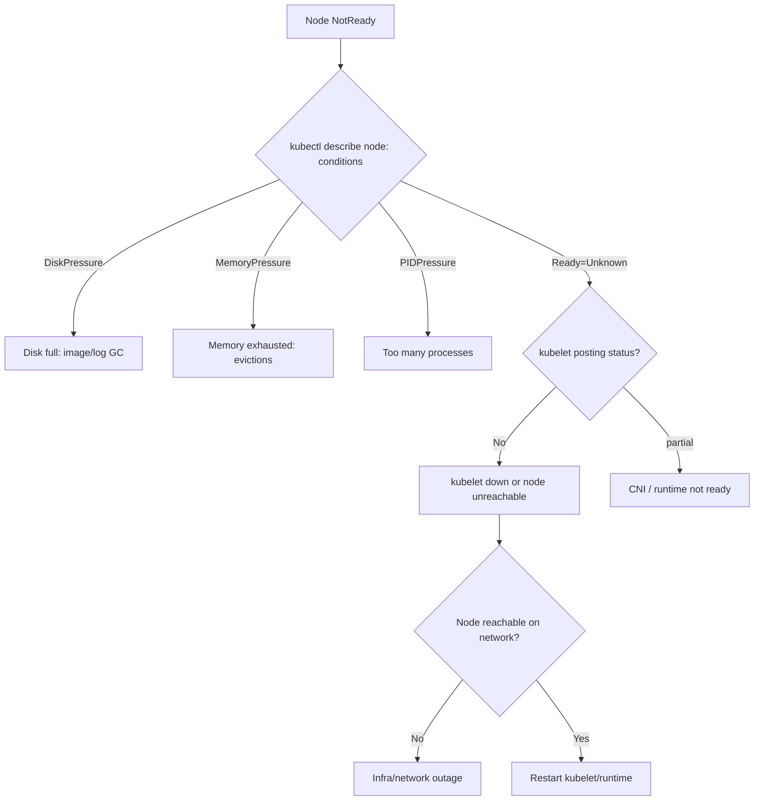

# Playbook: Node Failures

## When to use this playbook

Use this when one or more nodes go `NotReady`, `Unreachable`, or start evicting
pods under resource pressure — and workloads on them are degraded or migrating.
This covers a single dead node, a flapping kubelet, disk/memory/PID pressure, and
a node that stopped posting status. The goal is to confine blast radius, move
work safely, and decide repair vs. replace. Triage is read-only.

## Symptoms

- `kubectl get nodes` shows `NotReady`, `Unknown`, or `SchedulingDisabled`.
- Pods on the node go `Terminating`/`Unknown`, then reschedule elsewhere (or get stuck).
- Events: `NodeNotReady`, `NodeHasDiskPressure`, `NodeHasMemoryPressure`, `Kubelet stopped posting node status`.
- A whole zone/rack of nodes drops at once (infra/network event).

## Triage flow



## Step-by-step

1. **Survey all nodes and find the scope.**

   ```bash
   kubectl get nodes -o wide
   kubectl get nodes -o wide | grep -v " Ready"
   ```

   One node vs. a zone changes everything — multiple at once means infra.

2. **Read the node's conditions and recent events.**

   ```bash
   kubectl describe node <node> | grep -A15 "Conditions"
   kubectl describe node <node> | grep -A10 "Events"
   ```

   `DiskPressure`/`MemoryPressure`/`PIDPressure=True` or `Ready=Unknown` with
   "kubelet stopped posting" tells you the failure class immediately.

3. **See what is (or was) running there** so you understand impact:

   ```bash
   kubectl get pods -A -o wide --field-selector spec.nodeName=<node>
   ```

4. **Check kubelet/runtime health on the node** (read-only) if you have access:

   ```bash
   kubectl get --raw "/api/v1/nodes/<node>/proxy/healthz"
   ```

5. **Confirm node resource exhaustion** vs. a control-plane comms issue:

   ```bash
   kubectl top nodes
   kubectl get events -A --sort-by=.lastTimestamp | grep -i "<node>"
   ```

## Common root causes & fixes

| Root cause | Fix | Error page |
| --- | --- | --- |
| Generic NotReady | Diagnose kubelet/CNI/runtime | [nodenotready](../errors/nodes/nodenotready.md) |
| Disk full | Free space / image GC / grow disk | [node-diskpressure](../errors/nodes/node-diskpressure.md) |
| Memory exhausted | Reduce load / add memory | [node-memorypressure](../errors/nodes/node-memorypressure.md) |
| PID exhaustion | Raise `pid.max` / kill leak | [node-pidpressure](../errors/nodes/node-pidpressure.md) |
| Kubelet stopped posting | Restart/repair kubelet | [kubelet-stopped-posting-status](../errors/nodes/kubelet-stopped-posting-status.md) |
| Node unreachable on network | Fix network / replace node | [node-unreachable](../errors/nodes/node-unreachable.md) |
| CNI not ready on node | Restore CNI plugin | [node-networkunavailable](../errors/nodes/node-networkunavailable.md) |
| Kubelet won't start | Fix config/cert/cgroup | [kubelet-failed-to-start](../errors/kubelet/kubelet-failed-to-start.md) |
| NoExecute taint evicting | Resolve condition behind taint | [node-noexecute-taint-evicting](../errors/nodes/node-noexecute-taint-evicting.md) |

## Recovery

1. **Cordon first to stop the bleeding** — prevents new pods landing on a sick
   node while you decide. **Blast radius: none** (`kubectl cordon <node>` only
   marks unschedulable). Always the safe first move.
2. **Drain to migrate workloads** when repairing/replacing:
   `kubectl drain <node> --ignore-daemonsets --delete-emptydir-data`.
   **Blast radius: evicts all pods on the node** — can cause downtime for
   single-replica or PDB-violating workloads. Safer alternative: ensure replicas
   ≥2 and PDBs exist, drain during low traffic, and respect PDBs (do not use
   `--force` unless the node is already dead).
3. **Repair**: free disk / fix kubelet / reboot. For pressure conditions, GC
   images and logs before resizing the disk.
4. **Replace** if hardware/cloud-instance is dead: delete the node object after
   the instance is gone so the scheduler stops counting it. **Blast radius:
   permanent for that node** — confirm pods rescheduled first.
5. **Uncordon** once healthy: `kubectl uncordon <node>`.

## Validation

- `kubectl get nodes` shows the node `Ready` and schedulable (no
  `SchedulingDisabled`).
- `kubectl describe node <node>` shows all pressure conditions `False`.
- Pods reschedule and reach `Ready`; no orphaned `Terminating` pods remain.

## Prevention

- Reserve resources for system/kubelet (`--system-reserved`, `--kube-reserved`).
- Monitor disk/inode/memory/PID with alerts before pressure triggers eviction.
- Spread workloads across zones; size pools for N-1 node loss.
- Enforce `PodDisruptionBudget` so drains can't break quorum-based apps.
- Keep image GC and log rotation healthy to avoid DiskPressure.

## Related playbooks & errors

- [Playbook: Pod Scheduling Failures](./scheduling-failures.md)
- [Playbook: Control Plane Failures](./control-plane-failures.md)
- [Playbook: Networking Failures](./networking-failures.md)
- [node-out-of-disk](../errors/nodes/node-out-of-disk.md), [kubelet-pleg-not-healthy](../errors/kubelet/kubelet-pleg-not-healthy.md)

## Further Reading

- [DevOps AI ToolKit — Kubernetes guides](https://devopsaitoolkit.com/blog/)
