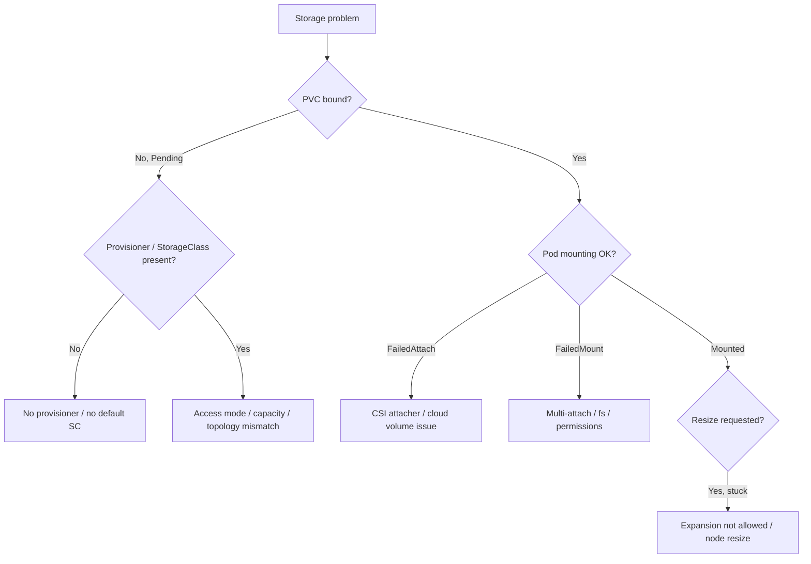

# Playbook: Persistent Volume Failures

## When to use this playbook

Use this playbook when stateful workloads cannot get, mount, or resize storage:
PVCs stuck `Pending`, pods stuck `ContainerCreating` on volume attach/mount, PVs
stuck `Released` or `Terminating`, or capacity/access-mode mismatches. It spans
the PVC → StorageClass → provisioner → PV → attach → mount chain. Because storage
holds real data, this playbook emphasizes diagnosis-first and backup-before-destroy.

## Symptoms

- PVC `STATUS: Pending` with no PV bound
- Pod stuck `ContainerCreating` with `FailedAttachVolume` or `FailedMount`
- `Multi-Attach error` when a RWO volume is requested on two nodes
- PV stuck `Released` (not reused) or `Terminating` (finalizer)
- Volume resize requested but capacity unchanged

## Triage flow



## Step-by-step

All commands are read-only.

1. Inspect the PVC and why it is unbound:

   ```bash
   kubectl get pvc -n <namespace>
   kubectl describe pvc <pvc> -n <namespace>
   ```

   Events reveal "no persistent volumes available", provisioning failures, or
   `waitforfirstconsumer`.

2. Check the StorageClass and provisioner:

   ```bash
   kubectl get storageclass
   kubectl get pods -n kube-system -l app=<csi-driver> -o wide
   ```

   Reveals a missing default class or a down CSI provisioner.

3. Inspect any PVs and their reclaim/bind state:

   ```bash
   kubectl get pv
   kubectl describe pv <pv>
   ```

   Reveals `Released` PVs held by `Retain`, capacity smaller than claim, or
   node-affinity restrictions.

4. For attach/mount failures, read the pod events and the node:

   ```bash
   kubectl describe pod <pod> -n <namespace> | sed -n '/Events/,$p'
   kubectl get volumeattachments | grep <pv>
   ```

   Reveals `FailedAttachVolume`, `Multi-Attach`, or CSI attacher timeouts.

5. Check the CSI driver registration and logs:

   ```bash
   kubectl get csidrivers
   kubectl logs -n kube-system <csi-controller-pod> -c csi-attacher --tail=80
   ```

   Reveals driver-not-registered or backend API errors.

6. For resize, inspect PVC conditions:

   ```bash
   kubectl get pvc <pvc> -n <namespace> -o jsonpath='{.status.conditions}'
   ```

   Reveals `FileSystemResizePending` or "expansion not allowed".

## Common root causes & fixes

| Root cause | Fix | Reference |
|---|---|---|
| No provisioner for class | Install/fix CSI provisioner | [pvc-pending-no-provisioner.md](../errors/persistent-volume-claims/pvc-pending-no-provisioner.md) |
| No default StorageClass | Mark a class default | [pvc-no-default-storageclass.md](../errors/persistent-volume-claims/pvc-no-default-storageclass.md) |
| Access mode unsupported | Use supported accessMode | [pvc-accessmode-unsupported.md](../errors/persistent-volume-claims/pvc-accessmode-unsupported.md) |
| Provisioning failed | Fix backend/quota | [pvc-provisioning-failed.md](../errors/persistent-volume-claims/pvc-provisioning-failed.md) |
| WaitForFirstConsumer stuck | Ensure schedulable pod | [pvc-waitforfirstconsumer-stuck.md](../errors/persistent-volume-claims/pvc-waitforfirstconsumer-stuck.md) |
| RWO on two nodes | Single-node / RWX | [multi-attach-error.md](../errors/storage/multi-attach-error.md) |
| Attach timeout | Check CSI attacher/cloud | [csi-attacher-deadline-exceeded.md](../errors/storage/csi-attacher-deadline-exceeded.md) |
| Mount timeout | Check node mount/fs | [failedmount-timeout.md](../errors/storage/failedmount-timeout.md) |
| PV stuck Released | Clear claimRef to reuse | [pv-released-not-reused.md](../errors/persistent-volumes/pv-released-not-reused.md) |
| PV stuck Terminating | Inspect finalizer | [pv-finalizer-stuck-terminating.md](../errors/persistent-volumes/pv-finalizer-stuck-terminating.md) |
| Resize not allowed | Enable allowVolumeExpansion | [pvc-resize-not-allowed.md](../errors/persistent-volume-claims/pvc-resize-not-allowed.md) |

## Recovery

1. Diagnose binding/attach first — most `Pending`/`ContainerCreating` cases clear
   once the provisioner or topology constraint is fixed, with no data risk.
2. To reuse a `Retain` PV stuck `Released`, clearing its `claimRef` rebinds it.
   **Blast radius: if you clear the claimRef on the wrong PV you can bind it to a
   new PVC and expose/overwrite existing data. Back up the PV spec
   (`kubectl get pv <pv> -o yaml`) and confirm the disk's contents first. Safer
   alternative: provision a fresh PV and migrate data.**
3. Removing a finalizer to unstick a `Terminating` PV/PVC is **destructive — it
   can detach a volume still in use and orphan the backing disk. Confirm no pod
   references it (`kubectl get pods -A -o wide`) and snapshot the backend disk
   before acting. Safer alternative: delete the consuming pod cleanly so the
   finalizer releases on its own.**
4. For multi-attach, scale the consumer to one node rather than force-detaching.

## Validation

- PVC shows `Bound`; pod reaches `Running` with the volume mounted.
- `kubectl exec` into the pod confirms the mount path and expected data.
- No `volumeattachment` errors; resize shows the new capacity in `df`.

## Prevention

- Define a default StorageClass and validate access modes per workload.
- Use `Retain` for critical data and document the rebind procedure.
- Enable volume snapshots and back up before any finalizer surgery.
- Monitor CSI driver health and PVC pending counts.

## Related playbooks & errors

- [Playbook: Worker Node Unavailable](./worker-node-unavailable.md)
- [failedattachvolume.md](../errors/storage/failedattachvolume.md)
- [volume-node-affinity-conflict.md](../errors/storage/volume-node-affinity-conflict.md)
- [pvc-storageclass-not-found.md](../errors/persistent-volume-claims/pvc-storageclass-not-found.md)

## Further Reading

- [DevOps AI ToolKit — Kubernetes guides](https://devopsaitoolkit.com/blog/)
