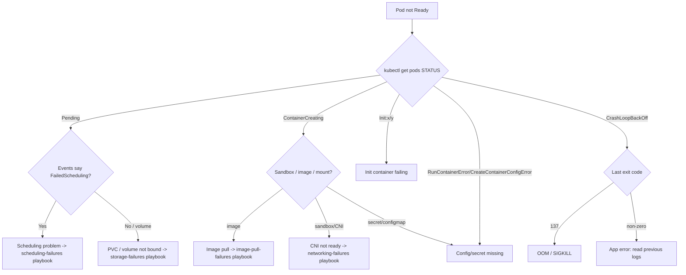

# Playbook: Pods Won't Start

## When to use this playbook

Use this playbook when one or more pods never reach `Running`/`Ready` — they are
stuck in `Pending`, `ContainerCreating`, `Init`, `CrashLoopBackOff`, or a
`*Error` state — and you need a structured way to narrow the failure from "the
whole pod lifecycle" down to the one stage that is actually broken. It covers a
new rollout that won't come up, a single replica that won't recover, and a whole
Deployment that is stuck. It deliberately stays read-only during triage.

## Symptoms

- `kubectl get pods` shows `Pending`, `ContainerCreating`, `Init:0/1`, `CrashLoopBackOff`, `ImagePullBackOff`, `CreateContainerConfigError`, or `RunContainerError`.
- `READY` column never reaches `n/n`; `RESTARTS` climbing.
- Deployment shows `AVAILABLE 0` and `progressing` condition stalls.
- Events stream with `FailedScheduling`, `Failed`, `BackOff`, or `Unhealthy`.
- A Service has zero endpoints because no pod is Ready.

## Triage flow



## Step-by-step

1. **Get the real state across the workload.**

   ```bash
   kubectl get pods -n <namespace> -o wide
   kubectl get deploy,rs -n <namespace>
   ```

   The `STATUS`, `RESTARTS`, and node placement tell you which lifecycle stage
   is failing and whether it is one pod or all replicas.

2. **Read the pod's events and container states.**

   ```bash
   kubectl describe pod <pod> -n <namespace>
   ```

   Scroll to `Events` and the `State`/`Last State` of each container/init
   container. This is the single most informative command — it distinguishes a
   scheduling failure from an image pull, a mount timeout, or a crash.

3. **Pull namespace events in time order** to catch quota/webhook denials that
   never reach the pod object:

   ```bash
   kubectl get events -n <namespace> --sort-by=.lastTimestamp
   ```

4. **If the container started and died, read the previous logs:**

   ```bash
   kubectl logs <pod> -c <container> -n <namespace> --previous
   ```

   A stack trace or `missing env/secret` line points straight at the cause.

5. **If it is `Pending`, confirm scheduling vs. volume:**

   ```bash
   kubectl get pod <pod> -n <namespace> -o jsonpath='{.status.conditions}'
   kubectl get pvc -n <namespace>
   ```

6. **Check resource limits for OOM (exit 137):**

   ```bash
   kubectl describe pod <pod> -n <namespace> | grep -A3 "Last State"
   kubectl top pod <pod> -n <namespace>
   ```

## Common root causes & fixes

| Root cause | Fix | Error page |
| --- | --- | --- |
| App crashes on boot (bad config, unhandled exception) | Read `--previous` logs, fix app/config | [crashloopbackoff](../errors/pods/crashloopbackoff.md) |
| Memory limit too low | Raise limit / fix leak | [oomkilled](../errors/pods/oomkilled.md) |
| Image can't be pulled | Fix tag/registry/secret | [imagepullbackoff](../errors/pods/imagepullbackoff.md) |
| Missing Secret/ConfigMap key | Create/repair referenced object | [createcontainerconfigerror](../errors/pods/createcontainerconfigerror.md) |
| Referenced Secret absent | Create the Secret | [secret-not-found](../errors/pods/secret-not-found.md) |
| Sandbox can't be created (CNI) | Restore CNI on the node | [failed-to-create-pod-sandbox](../errors/pods/failed-to-create-pod-sandbox.md) |
| Stuck pulling/creating | Inspect node + runtime | [containercreating-stuck](../errors/pods/containercreating-stuck.md) |
| Liveness probe killing slow starter | Add `startupProbe` | [liveness-probe-failed](../errors/pods/liveness-probe-failed.md) |
| No node fits the pod | See scheduling playbook | [failedscheduling](../errors/scheduler/failedscheduling.md) |

## Recovery

1. **Apply the corrected manifest** (config, limits, probes, image). For a
   multi-replica Deployment a rolling update is zero-downtime. **Blast radius:
   only the workload's pods are recreated.**
2. **Let the controller reconcile** rather than hand-deleting pods. If you must
   force a single pod fresh, `kubectl delete pod <pod>` is **disruptive to that
   one replica only**; the safer alternative is `kubectl rollout restart deploy/<name>`
   which respects surge/maxUnavailable.
3. **If a bad rollout caused it**, roll back: `kubectl rollout undo deploy/<name>`.
   **Blast radius: reverts all replicas to the prior ReplicaSet** — safer than
   editing live pods, and reversible via `rollout history`.
4. **If it is node-local** (sandbox/CNI on one node), cordon that node so new
   pods land elsewhere before deeper node work; see the node-failures playbook.

## Validation

- `kubectl get pods -n <namespace>` shows `Running` and `READY n/n` with
  `RESTARTS` no longer climbing.
- `kubectl get deploy -n <namespace>` shows `AVAILABLE` equal to desired.
- The backing Service has endpoints: `kubectl get endpoints <svc> -n <namespace>`.
- A functional healthcheck or smoke test passes.

## Prevention

- Validate config and secrets in CI; fail fast with a clear message.
- Set realistic requests/limits and a `startupProbe` for slow apps.
- Add readiness probes so flapping pods leave Service endpoints automatically.
- Pin images by digest and pre-pull on critical nodes.
- Use `PodDisruptionBudget` so rollouts and node ops don't take everything down.

## Related playbooks & errors

- [Playbook: Pod Scheduling Failures](./scheduling-failures.md)
- [Playbook: Image Pull Failures](./image-pull-failures.md)
- [Playbook: Storage Failures](./storage-failures.md)
- [pending](../errors/pods/pending.md), [runcontainererror](../errors/pods/runcontainererror.md)

## Further Reading

- [DevOps AI ToolKit — Kubernetes guides](https://devopsaitoolkit.com/blog/)
