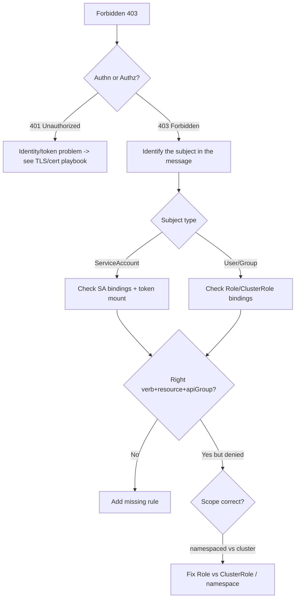

# Playbook: RBAC Problems

## When to use this playbook

Use this when the API server authorizes a request as `Forbidden` (HTTP 403) — a
user, a CI pipeline, or (most often) a workload's ServiceAccount can't perform an
action it needs. Typical triggers: a controller/operator that "stopped working,"
a new deploy whose pod can't list/watch resources, or a freshly created binding
that didn't take. This is distinct from authentication failures (401), which
this playbook helps you tell apart. Triage is read-only.

## Symptoms

- `Error from server (Forbidden): <verb> ... is forbidden: User "system:serviceaccount:ns:sa" cannot <verb> resource "x" in API group "y"`.
- An operator/controller logs repeated `forbidden` and stops reconciling.
- A pod using the Kubernetes API gets 403s after a chart upgrade.
- A user is denied despite "having a role" (wrong namespace/scope/apiGroup).

## Triage flow



## Step-by-step

1. **Read the full Forbidden message — it names subject, verb, resource, apiGroup.**
   The string `cannot <verb> resource "<r>" in API group "<g>"` is the exact rule
   you must grant.

2. **Use `auth can-i` to confirm and reproduce the denial.**

   ```bash
   kubectl auth can-i <verb> <resource> -n <namespace> \
     --as=system:serviceaccount:<ns>:<sa>
   kubectl auth can-i --list -n <namespace> --as=system:serviceaccount:<ns>:<sa>
   ```

   `--list` shows everything the subject *can* do, exposing the gap.

3. **Find the bindings that apply to the subject.**

   ```bash
   kubectl get rolebindings,clusterrolebindings -A -o wide | grep <sa-or-user>
   ```

4. **Inspect the role's actual rules** for verb/resource/apiGroup mismatches.

   ```bash
   kubectl describe clusterrole <role>
   kubectl get role <role> -n <namespace> -o yaml
   ```

   A common bug: correct verb/resource but wrong `apiGroups` (e.g. `""` vs `apps`).

5. **For ServiceAccounts, verify the token is actually mounted** in the pod:

   ```bash
   kubectl get pod <pod> -n <namespace> -o jsonpath='{.spec.serviceAccountName} {.spec.automountServiceAccountToken}'
   ```

## Common root causes & fixes

| Root cause | Fix | Error page |
| --- | --- | --- |
| SA lacks permission | Bind SA to a Role/ClusterRole | [forbidden-serviceaccount](../errors/rbac/forbidden-serviceaccount.md) |
| User can't list resource | Grant via (Cluster)RoleBinding | [forbidden-user-cannot-list](../errors/rbac/forbidden-user-cannot-list.md) |
| Role missing the verb | Add verb to the rule | [clusterrole-missing-verb](../errors/rbac/clusterrole-missing-verb.md) |
| Wrong apiGroup in rule | Correct `apiGroups` | [rbac-apigroup-mismatch](../errors/rbac/rbac-apigroup-mismatch.md) |
| RoleBinding in wrong namespace | Bind in the resource's namespace | [rolebinding-wrong-namespace](../errors/rbac/rolebinding-wrong-namespace.md) |
| Namespaced binding for cluster resource | Use ClusterRoleBinding | [namespaced-binding-for-cluster-resource](../errors/rbac/namespaced-binding-for-cluster-resource.md) |
| SA token not mounted | Enable automount / fix SA | [serviceaccount-token-not-mounted](../errors/rbac/serviceaccount-token-not-mounted.md) |
| Token expired (bound SA token) | Restart pod to refresh | [bound-sa-token-expired](../errors/rbac/bound-sa-token-expired.md) |
| Actually 401, not 403 | Fix identity/cert/token | [unauthorized-401](../errors/rbac/unauthorized-401.md) |

## Recovery

1. **Grant the minimum missing permission.** Add the specific verb/resource/
   apiGroup to an existing Role, or create a tightly scoped RoleBinding. **Blast
   radius: only the bound subject** — RBAC changes take effect immediately, no
   restart needed for the *authorization* itself.
2. **Prefer namespaced Role + RoleBinding** over cluster-wide grants. Avoid
   binding `cluster-admin` as a quick fix — that is a **broad privilege
   escalation with cluster-wide blast radius**. Safer alternative: copy the exact
   rule from the error message into a least-privilege role.
3. **If the issue is a missing/expired token mount**, the pod needs a restart to
   pick up a fresh projected token. `kubectl rollout restart deploy/<name>` —
   **blast radius: the workload's pods recreate** (zero-downtime for multi-replica).
4. **Never delete `system:` default ClusterRoles/bindings** to "reset" RBAC — that
   is **destructive to core cluster function**.

## Validation

- `kubectl auth can-i <verb> <resource> --as=...` now returns `yes`.
- The controller/pod stops logging `forbidden` and resumes reconciling.
- `kubectl auth can-i --list --as=...` shows the new rule and nothing broader than intended.

## Prevention

- Author least-privilege roles; copy verb/resource/apiGroup straight from API discovery.
- Review RBAC diffs in CI; lint for wildcard verbs/resources and `cluster-admin` bindings.
- Use distinct ServiceAccounts per workload; don't reuse `default`.
- Audit with `kubectl auth can-i --list` for sensitive SAs periodically.
- Prefer aggregated ClusterRoles for extensible, reviewable permissions.

## Related playbooks & errors

- [Playbook: TLS & Certificate Problems](./tls-certificate-problems.md)
- [Playbook: Control Plane Failures](./control-plane-failures.md)
- [rbac-escalation-denied](../errors/rbac/rbac-escalation-denied.md), [impersonation-denied](../errors/rbac/impersonation-denied.md)

## Further Reading

- [DevOps AI ToolKit — Kubernetes guides](https://devopsaitoolkit.com/blog/)
