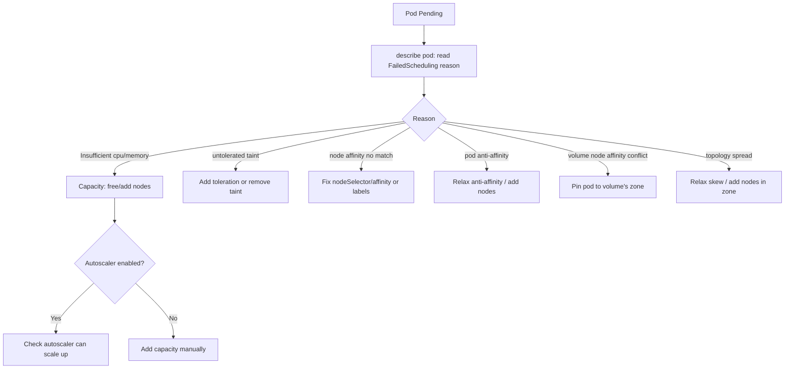

# Playbook: Pod Scheduling Failures

## When to use this playbook

Use this when pods stay `Pending` because the scheduler cannot place them on any
node — `0/N nodes are available` with reasons like insufficient CPU/memory,
untolerated taints, unsatisfied node/pod affinity, volume node-affinity
conflicts, or topology-spread constraints. This is the classic "capacity won't
free up" or "constraints are too tight" incident. Triage stays read-only.

## Symptoms

- `kubectl get pods` shows `Pending` with age increasing and no node assigned.
- Events: `FailedScheduling 0/12 nodes are available: 5 Insufficient cpu, 4 node(s) had untolerated taint, 3 didn't match node affinity`.
- A scaled-up Deployment never reaches desired `AVAILABLE`.
- Cluster-autoscaler logs "no scale-up" or "max nodes reached".

## Triage flow



## Step-by-step

1. **Confirm the pod is unscheduled and read the exact reason.**

   ```bash
   kubectl get pods -n <namespace> -o wide | grep Pending
   kubectl describe pod <pod> -n <namespace> | grep -A10 "FailedScheduling"
   ```

   The reason string enumerates *why each node was rejected* — this is the whole
   diagnosis in one line.

2. **Inspect what the pod is asking for.**

   ```bash
   kubectl get pod <pod> -n <namespace> -o jsonpath='{.spec.containers[*].resources}'
   kubectl get pod <pod> -n <namespace> -o jsonpath='{.spec.nodeSelector}{.spec.affinity}{.spec.tolerations}'
   ```

   Compare requested CPU/memory and constraints against reality.

3. **Look at node capacity and taints.**

   ```bash
   kubectl describe nodes | grep -A5 "Allocatable\|Taints"
   kubectl top nodes
   ```

   Confirm whether nodes truly lack room or are merely tainted/labeled wrong.

4. **Check the scheduler itself is running** (a stuck scheduler leaves *all* new
   pods Pending):

   ```bash
   kubectl get pods -n kube-system -l component=kube-scheduler -o wide
   ```

5. **If autoscaling should add nodes, check it:**

   ```bash
   kubectl -n kube-system logs deploy/cluster-autoscaler --tail=50
   ```

## Common root causes & fixes

| Root cause | Fix | Error page |
| --- | --- | --- |
| Not enough CPU/memory anywhere | Add nodes / lower requests | [scheduler-insufficient-resources](../errors/scheduler/scheduler-insufficient-resources.md) |
| Generic no-fit | Read full reason string | [failedscheduling](../errors/scheduler/failedscheduling.md) |
| Node taint not tolerated | Add toleration / remove taint | [scheduler-untolerated-taint](../errors/scheduler/scheduler-untolerated-taint.md) |
| Node affinity matches nothing | Fix selector or node labels | [scheduler-node-affinity-no-match](../errors/scheduler/scheduler-node-affinity-no-match.md) |
| Anti-affinity too strict | Relax rule / add nodes | [pod-anti-affinity-unsatisfied](../errors/scheduler/pod-anti-affinity-unsatisfied.md) |
| Topology spread skew unmet | Loosen `maxSkew` / add zone capacity | [topology-spread-unsatisfied](../errors/scheduler/topology-spread-unsatisfied.md) |
| Volume bound to other zone | Schedule pod to volume's zone | [scheduler-volume-node-affinity-conflict](../errors/scheduler/scheduler-volume-node-affinity-conflict.md) |
| Missing PriorityClass | Create class / fix name | [scheduler-priorityclass-not-found](../errors/scheduler/scheduler-priorityclass-not-found.md) |
| Autoscaler not scaling up | Fix limits/quotas/provisioner | [cluster-autoscaler-not-scaling-up](../errors/autoscaling/cluster-autoscaler-not-scaling-up.md) |

## Recovery

1. **If constraints are too tight**, relax the offending one (toleration,
   affinity, `maxSkew`) and let the controller re-create pods. **Blast radius:
   spec change recreates the workload's pods only** — non-disruptive for a
   multi-replica Deployment.
2. **If it's pure capacity**, add nodes (scale the node pool / fix autoscaler).
   This is the safest fix because it changes nothing about running workloads.
3. **Avoid mass-cordoning or draining to "rebalance"** — draining a node to free
   room is **disruptive: it evicts that node's running pods**. Safer alternative:
   add capacity first, then drain only if you specifically need to move data.
4. **Lowering resource requests** unblocks scheduling but can cause node
   contention; prefer right-sizing with data, and roll out gradually.

## Validation

- `kubectl get pods -n <namespace>` shows the formerly Pending pods `Running`.
- `kubectl describe pod <pod>` shows a `Scheduled` event with a node name.
- `kubectl get deploy -n <namespace>` reaches desired `AVAILABLE`.

## Prevention

- Set requests from real usage; oversized requests waste capacity and block scheduling.
- Keep headroom or a working cluster-autoscaler / Karpenter for burst.
- Use `PriorityClass` so critical pods preempt best-effort ones.
- Review affinity/anti-affinity and topology spread for feasibility before merge.
- Alert on `Pending > 5m` to catch silent capacity creep.

## Related playbooks & errors

- [Playbook: Pods Won't Start](./pods-wont-start.md)
- [Playbook: Node Failures](./node-failures.md)
- [Playbook: Storage Failures](./storage-failures.md)
- [pod-untolerated-taint](../errors/pods/pod-untolerated-taint.md), [pod-insufficient-cpu](../errors/pods/pod-insufficient-cpu.md)

## Further Reading

- [DevOps AI ToolKit — Kubernetes guides](https://devopsaitoolkit.com/blog/)
