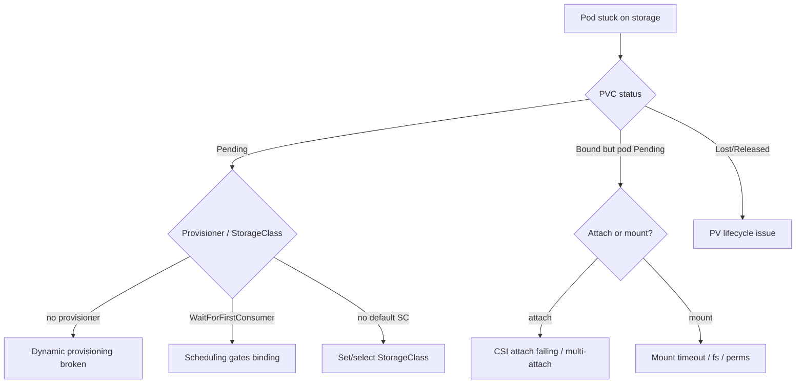

# Playbook: Storage Failures

## When to use this playbook

Use this when pods can't get their storage: PVCs stuck `Pending`, volumes that
won't attach or mount, multi-attach conflicts on RWO disks, stuck `Terminating`
PVs, or failed volume expansion. Stateful workloads (databases, queues) are the
usual victims and the stakes include data availability — so this playbook is
conservative about anything that touches volume lifecycle. Triage is read-only.

## Symptoms

- `kubectl get pvc` shows `Pending`; pod stuck `ContainerCreating`.
- Events: `FailedAttachVolume`, `FailedMount`, `Multi-Attach error for volume`, `waiting for first consumer`.
- `kubectl get pv` shows `Released` not reused, or `Terminating` stuck on a finalizer.
- StatefulSet pod won't start because its PVC won't bind.

## Triage flow



## Step-by-step

1. **Check the PVC and its binding.**

   ```bash
   kubectl get pvc -n <namespace>
   kubectl describe pvc <pvc> -n <namespace>
   ```

   `Pending` + provisioning events tells you whether the StorageClass /
   provisioner is the problem or whether it's waiting for a consumer.

2. **Inspect the StorageClass and provisioner.**

   ```bash
   kubectl get storageclass
   kubectl get pods -n kube-system -l app=<csi-driver> -o wide
   ```

   Confirm a default SC exists and the CSI controller/node pods are healthy.

3. **If the PVC is Bound but the pod is stuck, look at attach/mount.**

   ```bash
   kubectl describe pod <pod> -n <namespace> | grep -A5 -i "attach\|mount\|volume"
   kubectl get volumeattachment | grep <pv-name>
   ```

   `Multi-Attach error` means an RWO volume is still attached to another node.

4. **For stuck PV deletion, check finalizers and reclaim policy:**

   ```bash
   kubectl get pv <pv> -o jsonpath='{.spec.persistentVolumeReclaimPolicy} {.status.phase} {.metadata.finalizers}'
   ```

5. **For expansion issues, check conditions:**

   ```bash
   kubectl describe pvc <pvc> -n <namespace> | grep -A5 Conditions
   ```

## Common root causes & fixes

| Root cause | Fix | Error page |
| --- | --- | --- |
| No provisioner for SC | Install/fix CSI provisioner | [pvc-pending-no-provisioner](../errors/persistent-volume-claims/pvc-pending-no-provisioner.md) |
| No default StorageClass | Mark one default / set SC | [pvc-no-default-storageclass](../errors/persistent-volume-claims/pvc-no-default-storageclass.md) |
| WaitForFirstConsumer stuck | Ensure pod is schedulable | [pvc-waitforfirstconsumer-stuck](../errors/persistent-volume-claims/pvc-waitforfirstconsumer-stuck.md) |
| Volume won't attach | Check CSI attacher / cloud quota | [failedattachvolume](../errors/storage/failedattachvolume.md) |
| Mount times out | Check node CSI / fs | [failedmount-timeout](../errors/storage/failedmount-timeout.md) |
| RWO attached elsewhere | Detach from old node | [multi-attach-error](../errors/storage/multi-attach-error.md) |
| CSI driver not registered | Reinstall/register driver | [csi-driver-not-registered](../errors/storage/csi-driver-not-registered.md) |
| PV stuck Terminating | Clear finalizer after backend deleted | [pv-finalizer-stuck-terminating](../errors/persistent-volumes/pv-finalizer-stuck-terminating.md) |
| Volume zone ≠ pod zone | Pin pod to volume zone | [volume-node-affinity-conflict](../errors/storage/volume-node-affinity-conflict.md) |

## Recovery

1. **Fix provisioning/attach root cause** (StorageClass, CSI health, cloud
   quota), then let the PVC bind and the pod retry — no destructive action
   needed. This is the default path.
2. **For multi-attach on RWO**, ensure the old pod is fully terminated so the
   volume detaches before the new pod attaches. **Avoid force-deleting the old
   pod** while it may still be writing — that risks **data corruption**. Safer
   alternative: cordon/scale down the old holder gracefully and confirm the
   VolumeAttachment is gone.
3. **Clearing a PV/PVC finalizer is a last resort.** Removing finalizers on a
   bound PVC/PV is **destructive — it can orphan or delete data**. Only do it
   after confirming the backend disk's fate, and prefer fixing the controller
   that should remove the finalizer.
4. **Never delete a PVC to "unstick" a database** without a backup — with
   `Delete` reclaim policy the underlying volume is **destroyed**. Snapshot first.

## Validation

- `kubectl get pvc -n <namespace>` shows `Bound`.
- The pod reaches `Running` and the mount is present (app can read/write).
- `kubectl get volumeattachment` shows the volume attached to the correct node only.
- For expansion, PVC capacity reflects the new size and `FileSystemResizePending` clears.

## Prevention

- Always set a sensible default StorageClass and use `WaitForFirstConsumer` for zonal disks.
- Use `Retain` reclaim policy for critical data; back up with volume snapshots.
- Monitor CSI controller/node pod health and cloud volume quotas.
- For HA across nodes use RWX-capable storage; don't assume RWO can move instantly.
- Test failover/restore of stateful apps regularly.

## Related playbooks & errors

- [Playbook: Pods Won't Start](./pods-wont-start.md)
- [Playbook: Pod Scheduling Failures](./scheduling-failures.md)
- [Playbook: Node Failures](./node-failures.md)
- [pvc-provisioning-failed](../errors/persistent-volume-claims/pvc-provisioning-failed.md), [rwo-multinode-conflict](../errors/storage/rwo-multinode-conflict.md)

## Further Reading

- [DevOps AI ToolKit — Kubernetes guides](https://devopsaitoolkit.com/blog/)
