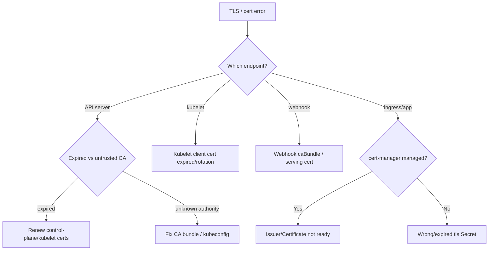

# Playbook: TLS & Certificate Problems

## When to use this playbook

Use this when TLS/PKI is the failure: `x509` errors talking to the API server,
expired kubelet/control-plane certificates, cert-manager Certificates stuck
`not ready`, ingress serving the wrong/fake cert, admission webhooks failing
their TLS handshake, or `tls.crt`/`tls.key` Secrets that are malformed. These
incidents are time-sensitive (a quietly expiring CA can take the cluster down)
and span node, control-plane, and app layers. Triage is read-only.

## Symptoms

- `x509: certificate has expired or is not yet valid` / `certificate signed by unknown authority`.
- `kubectl` fails with TLS errors; kubelets go `NotReady` after a cert epoch.
- Webhooks fail: `failed calling webhook ...: x509` and admissions are blocked.
- Ingress shows a browser cert warning or the controller's default fake cert.
- cert-manager `Certificate` stays `Ready=False` and the Secret isn't issued.

## Triage flow



## Step-by-step

1. **Identify which TLS endpoint is failing** from the error context (kubeconfig,
   kubelet logs, webhook, ingress, app). The fix differs entirely per layer.

2. **For API/control-plane, check cert expiry.**

   ```bash
   kubectl get --raw='/readyz?verbose'
   kubectl get csr
   ```

   Pending `kubelet-serving`/client CSRs or readiness failures point at rotation
   problems. (On the node, `kubeadm certs check-expiration` lists expiry.)

3. **Inspect a TLS Secret's contents and validity (read-only).**

   ```bash
   kubectl get secret <tls-secret> -n <namespace> -o jsonpath='{.type}{"\n"}'
   kubectl get secret <tls-secret> -n <namespace> -o jsonpath='{.data.tls\.crt}' \
     | base64 -d | openssl x509 -noout -subject -issuer -dates
   ```

   Confirms `type: kubernetes.io/tls`, the SANs, issuer, and `notAfter`.

4. **For cert-manager, walk Issuer → Certificate → CertificateRequest → Order.**

   ```bash
   kubectl get certificate,certificaterequest,order,challenge -A
   kubectl describe certificate <cert> -n <namespace>
   ```

   The `describe` events show whether it's issuer config, DNS/HTTP challenge, or rate limits.

5. **For webhook x509, check the caBundle vs. the serving cert.**

   ```bash
   kubectl get validatingwebhookconfiguration,mutatingwebhookconfiguration -o wide
   ```

## Common root causes & fixes

| Root cause | Fix | Error page |
| --- | --- | --- |
| API server CA untrusted by client | Fix kubeconfig CA bundle | [api-server-x509-unknown-authority](../errors/api-server/api-server-x509-unknown-authority.md) |
| API TLS handshake timeout | Check LB/cert size/load | [api-server-tls-handshake-timeout](../errors/api-server/api-server-tls-handshake-timeout.md) |
| Kubelet client cert expired | Renew/rotate kubelet cert | [kubelet-client-certificate-expired](../errors/kubelet/kubelet-client-certificate-expired.md) |
| Kubelet serving CSR unapproved | Approve CSR / fix signer | [kubelet-serving-csr-not-approved](../errors/kubelet/kubelet-serving-csr-not-approved.md) |
| Kubelet cert rotation failed | Fix rotation/signer | [kubelet-client-certificate-rotation-failed](../errors/nodes/kubelet-client-certificate-rotation-failed.md) |
| etcd TLS auth failure | Align etcd certs/CA | [etcd-tls-auth-failure](../errors/etcd/etcd-tls-auth-failure.md) |
| Webhook cert untrusted | Sync caBundle/serving cert | [admission-webhook-certificate-error](../errors/admission/admission-webhook-certificate-error.md) |
| cert-manager Certificate not ready | Fix Issuer/challenge | [certificate-not-ready](../errors/cert-manager/certificate-not-ready.md) |
| Cert expired, not renewed | Force renewal / fix issuer | [certificate-expired-not-renewed](../errors/cert-manager/certificate-expired-not-renewed.md) |
| Ingress serving fake cert | Fix TLS secret reference | [ingress-tls-fake-certificate](../errors/ingress/ingress-tls-fake-certificate.md) |
| Wrong Secret type for TLS | Recreate as `kubernetes.io/tls` | [tls-secret-wrong-type](../errors/security/tls-secret-wrong-type.md) |

## Recovery

1. **Renew before you replace.** For control-plane/kubelet expiry, rotate certs
   from the existing CA and restart the affected component. **Blast radius:
   restarting one API server/kubelet** (HA absorbs it); a single node's kubelet
   restart only disrupts that node's pod lifecycle, not running pods.
2. **For cert-manager**, fix the Issuer/challenge and let it re-issue; you can
   trigger renewal without deleting the Secret. **Avoid deleting a live TLS
   Secret** that ingress/webhooks depend on — that causes an **immediate outage
   for everything using it**. Safer alternative: issue the new cert into a new
   Secret and switch the reference.
3. **Rotating a CA is the highest-risk action** — it can invalidate every
   client/serving cert at once. **Blast radius: cluster-wide.** Do it as a
   planned dual-CA (trust both, then cut over), never as a hot fix.
4. **For unapproved kubelet CSRs**, approve them (`kubectl certificate approve`)
   so nodes can rejoin — low risk and reversible by the rotation cycle.

## Validation

- `kubectl get --raw='/readyz?verbose'` is healthy; kubectl/kubelets no longer error.
- `openssl x509 -dates` on the Secret shows a valid future `notAfter`.
- cert-manager `Certificate` shows `Ready=True`; webhooks admit requests again.
- Ingress serves the correct cert (no fake/default cert in the browser/`openssl s_client`).

## Prevention

- Monitor and alert on cert expiry (control-plane, kubelet, webhooks, ingress) well ahead of `notAfter`.
- Enable kubelet cert rotation and auto-approval for serving CSRs.
- Let cert-manager manage app/webhook certs with healthy Issuers and renewal windows.
- Use dual-CA rotation procedures; never single-step a CA swap.
- Validate Secret `type: kubernetes.io/tls` and SANs in CI.

## Related playbooks & errors

- [Playbook: Control Plane Failures](./control-plane-failures.md)
- [Playbook: RBAC Problems](./rbac-problems.md)
- [Playbook: Node Failures](./node-failures.md)
- [issuer-not-ready](../errors/cert-manager/issuer-not-ready.md), [api-server-failed-calling-webhook](../errors/api-server/api-server-failed-calling-webhook.md)

## Further Reading

- [DevOps AI ToolKit — Kubernetes guides](https://devopsaitoolkit.com/blog/)
