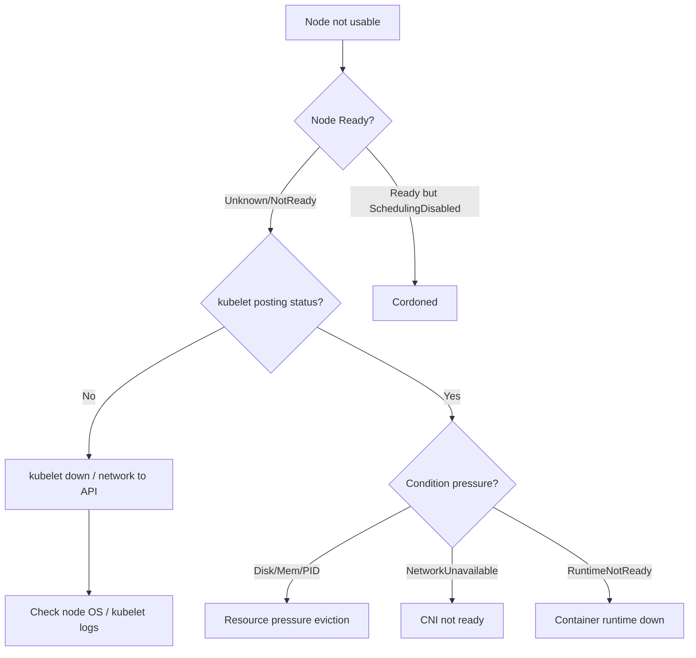

# Playbook: Worker Node Unavailable

## When to use this playbook

Use this playbook when one or more worker nodes go `NotReady`, `Unknown`, or
`Unreachable`, when pods are being evicted from a node, or when a node stops
accepting new pods. A lost node reschedules its workloads and can cascade into
capacity pressure, so act before more nodes follow. The goal is to determine
whether the cause is the kubelet, the container runtime, networking (CNI),
resource pressure, or the underlying machine — using read-only checks.

## Symptoms

- `kubectl get nodes` shows `NotReady`, `Unknown`, or `SchedulingDisabled`
- Pods on the node move to `Terminating`/`Unknown` or get evicted
- `kubelet stopped posting node status` in events
- Node conditions show `MemoryPressure`, `DiskPressure`, or `PIDPressure`
- New pods won't schedule onto the node ("node(s) had untolerated taint")

## Triage flow



## Step-by-step

All commands are read-only. Some need SSH if the kubelet is down.

1. Get node status, roles, and conditions:

   ```bash
   kubectl get nodes -o wide
   kubectl describe node <node> | sed -n '/Conditions/,/Events/p'
   ```

   Reveals the Ready condition reason and any pressure conditions.

2. Check when the kubelet last posted status:

   ```bash
   kubectl get node <node> -o jsonpath='{.status.conditions[?(@.type=="Ready")]}'
   kubectl get events --field-selector involvedObject.name=<node> --sort-by=.lastTimestamp
   ```

   "stopped posting status" points to kubelet/network rather than the OS.

3. On the node, inspect kubelet and runtime health:

   ```bash
   systemctl status kubelet
   journalctl -u kubelet --no-pager | tail -100
   crictl info | head -40
   ```

   Reveals kubelet crashes, cgroup-driver mismatch, or runtime failures.

4. Confirm the runtime and CNI are up:

   ```bash
   systemctl status containerd
   ls /etc/cni/net.d/
   ```

   Missing CNI config surfaces as `NetworkUnavailable`/sandbox errors.

5. Check resource pressure and disk:

   ```bash
   df -h /var/lib/kubelet /var/lib/containerd
   kubectl top node <node>
   ```

   Reveals DiskPressure/MemoryPressure root causes.

6. Verify the kubelet can reach the API server:

   ```bash
   journalctl -u kubelet --no-pager | grep -i 'apiserver\|certificate\|Unauthorized' | tail -20
   ```

   Reveals expired kubelet certs or connectivity loss.

7. Check taints that block scheduling:

   ```bash
   kubectl get node <node> -o jsonpath='{.spec.taints}'
   ```

## Common root causes & fixes

| Root cause | Fix | Reference |
|---|---|---|
| Node NotReady | Restore kubelet/runtime/CNI | [nodenotready.md](../errors/nodes/nodenotready.md) |
| kubelet not posting status | Restart kubelet / fix net | [kubelet-stopped-posting-status.md](../errors/nodes/kubelet-stopped-posting-status.md) |
| Node unreachable | Check machine/network | [node-unreachable.md](../errors/nodes/node-unreachable.md) |
| DiskPressure | Free disk / image GC | [node-diskpressure.md](../errors/nodes/node-diskpressure.md) |
| MemoryPressure | Reduce load / right-size | [node-memorypressure.md](../errors/nodes/node-memorypressure.md) |
| PIDPressure | Limit processes/pods | [node-pidpressure.md](../errors/nodes/node-pidpressure.md) |
| NetworkUnavailable | Fix CNI | [node-networkunavailable.md](../errors/nodes/node-networkunavailable.md) |
| Runtime net not ready | Fix CNI plugin | [node-container-runtime-network-not-ready.md](../errors/nodes/node-container-runtime-network-not-ready.md) |
| kubelet cert expired | Rotate certs | [kubelet-client-certificate-expired.md](../errors/kubelet/kubelet-client-certificate-expired.md) |
| Cordoned | Uncordon when healthy | [node-schedulingdisabled.md](../errors/nodes/node-schedulingdisabled.md) |

## Recovery

1. Diagnose first. A `NotReady` node often recovers on its own once the kubelet
   or CNI is restarted — avoid deleting the Node object prematurely.
2. To do maintenance, cordon then drain: `kubectl cordon <node>` then
   `kubectl drain <node> --ignore-daemonsets --delete-emptydir-data`. **Blast
   radius: drain evicts every pod on the node; ensure cluster capacity and PDBs
   allow it, or you cause downtime. Safer alternative: drain one node at a time
   and confirm replacements become Ready first.**
3. Restarting the kubelet/containerd recovers most software faults. **Blast
   radius: pods on that node briefly lose their managing agent; running
   containers usually survive a kubelet restart. Safer alternative: drain before
   restarting if the node hosts singletons.**
4. Deleting the Node object forces reschedule of stuck pods but **abandons the
   node and its local data** — only do this for a confirmed-dead machine, and
   prefer cloud auto-replacement.

## Validation

- `kubectl get nodes` shows the node `Ready` and not `SchedulingDisabled`.
- Node conditions clear (`MemoryPressure=False`, etc.).
- Pods schedule onto the node; DaemonSet pods are running.
- `kubectl top node` shows healthy utilization.

## Prevention

- Set eviction thresholds and resource requests to avoid pressure cascades.
- Monitor node Ready transitions and kubelet heartbeat lag.
- Automate certificate rotation for kubelets.
- Spread workloads with topology constraints so one node loss is absorbable.

## Related playbooks & errors

- [Playbook: Autoscaler Failures](./autoscaler-failures.md)
- [Playbook: Cluster Bootstrap Failures](./cluster-bootstrap-failures.md)
- [node-noexecute-taint-evicting.md](../errors/nodes/node-noexecute-taint-evicting.md)
- [kubelet-cannot-connect-apiserver.md](../errors/kubelet/kubelet-cannot-connect-apiserver.md)

## Further Reading

- [DevOps AI ToolKit — Kubernetes guides](https://devopsaitoolkit.com/blog/)
